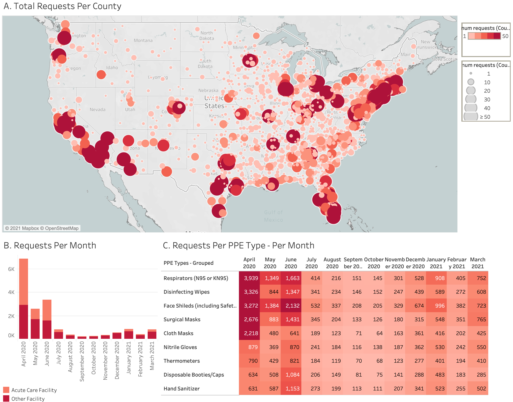

## PPE Needs in the United States During the Covid-19 Pandemic - A Retrospective Analysis 
Unprecedented global surge in demand for personal protective equipment (PPE) during the COVID-19 pandemic overwhelmed existing supply chains. Tracking unmet PPE demand is necessary to triage distribution to facilities in greatest need and to guide policy. To facilitate  large scale data-driven distribution of PPE donations, [GetUsPPE](https://getusppe.org/) collected supply remaining and demand data from facilities since March 2020. Here, we update findings published in May 2020 and report new data collected through March 2021 about PPE needs and facility characteristics

#### PPE Requests by US County, Month, Facility Type and PPE Type

#### Data
All data in this study was queried on 4/24/2021 from the GetUsPPE Gateway database. The SQL queries used can be found [here](https://github.com/GetUsPPE/ppe_needs_retrospective/tree/main/src/sql). CSV Data outputs of these queries can be found [here](https://github.com/GetUsPPE/ppe_needs_retrospective/tree/main/data)

#### Acknowledgements
This work is the culmination of over 200 individuals who contributed to data collection and developed the GetUsPPE database. 

Here is a shortlist of these individuals from across [GetUsPPE](https://getusppe.org/) and [Findthemasks](https://findthemasks.com/) who made this study possible!
- Matthew Rubashkin 
- Kelsey Coolahan
- Taylor Purzycki
- Charlotte Lee
- Daniel Lurie 
- Benjamin Batorsky
- Alexander Chen 
- Joanna Calderón
- Shuhan He
- Stephanie Zeller
- Sunny Mui
- Ryan Cranfill
- Jonathan Rubashkin
- Lisa Watts
- Cody Reinold
- Cle Diggins
- Lisa Nash
- Lukas Bergstrom
- Alecio Madrid
- Rachel Popkin
- Catherine Chang
- Albert Wong
- Linda Yang
- Adam L Beckman
- Keyon Vafa
- Suhas Gondi
- Galen Hu
- Melissa Song
- Megan Ranney
- Shikha Gupta
